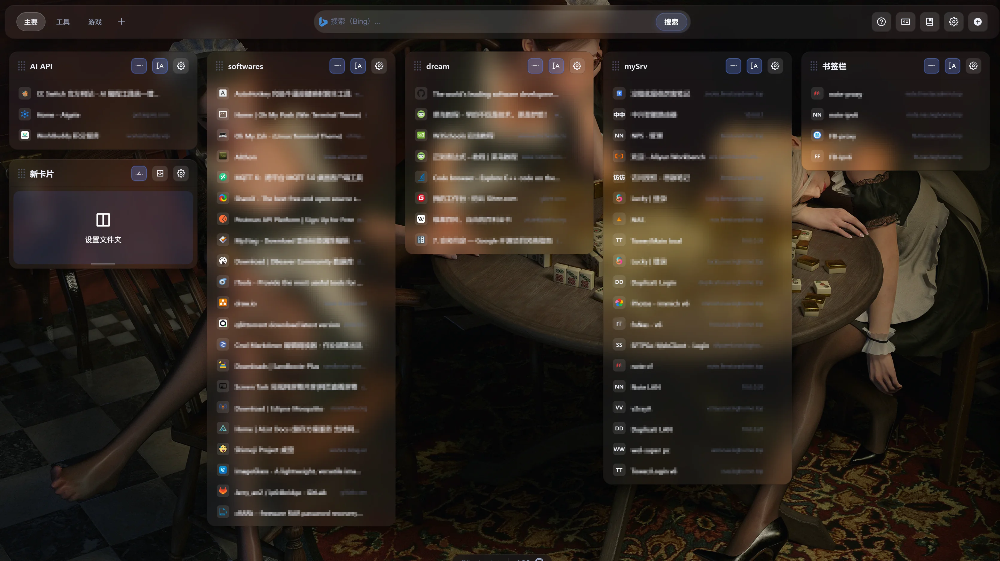
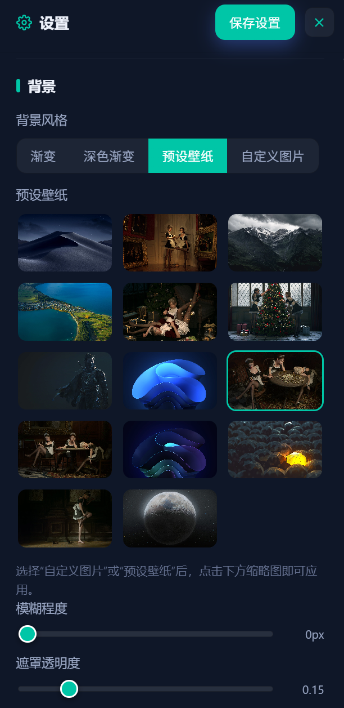
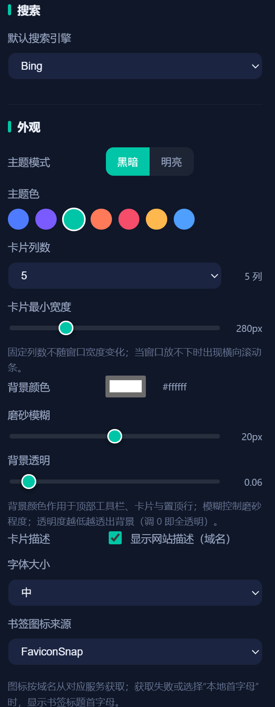
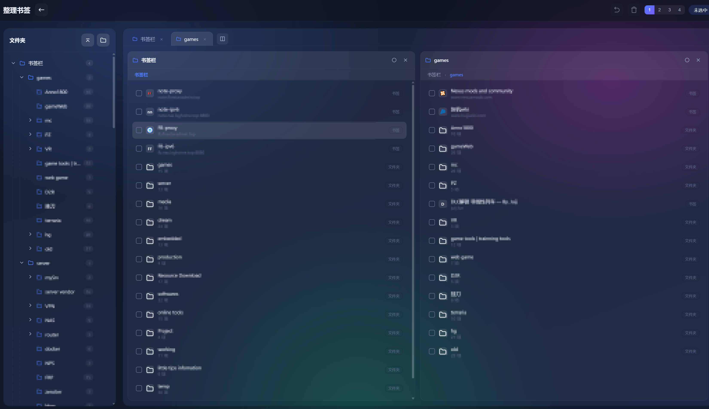
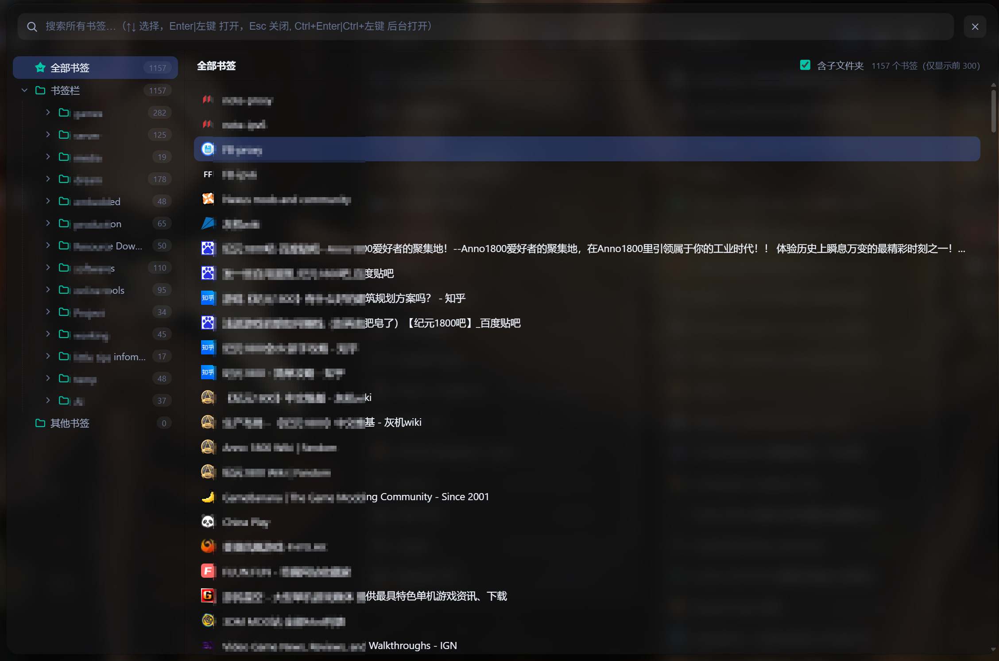

# GG Bookmark

> **为 Google Chrome 打造的高性能书签起始页。**

GG Bookmark 将新标签页打造成一个美观、专注的书签指挥中心。它基于最新的 Web 平台标准构建，采用磨砂玻璃设计语言，在优雅的外观与 Chrome 原生 API 的速度之间取得平衡。

---

## 📑 目录

- [GG Bookmark](#gg-bookmark)
  - [📑 目录](#-目录)
  - [✨ 概览](#-概览)
  - [🚀 核心功能](#-核心功能)
    - [新标签页起始页](#新标签页起始页)
    - [书签整理器](#书签整理器)
    - [设置面板](#设置面板)
    - [WebDAV 同步](#webdav-同步)
  - [📜 更新日志](#-更新日志)
  - [界面预览](#界面预览)
    - [新标签页](#新标签页)
    - [设置页面](#设置页面)
    - [书签整理页面](#书签整理页面)
    - [快速打开书签面板](#快速打开书签面板)
  - [🛠 安装](#-安装)
  - [📁 项目结构](#-项目结构)
  - [🔧 技术说明](#-技术说明)
    - [Chrome 书签节点模型](#chrome-书签节点模型)
    - [隐私与数据](#隐私与数据)
  - [✅ 已完成功能](#-已完成功能)
  - [🗺 正在开发](#-正在开发)
  - [7、其他的你看看有没有要补充的功能或修复，总之就是让用户用着很方便，很快捷，很稳定](#7其他的你看看有没有要补充的功能或修复总之就是让用户用着很方便很快捷很稳定)
  - [⚠️ 无法实现](#️-无法实现)
  - [📄 许可证](#-许可证)

---

## ✨ 概览

| | |
|---|---|
| **平台** | Google Chrome / Edge（Chromium） |
| **架构** | Manifest V3，零运行时依赖 |
| **设计** | 磨砂现代化玻璃 UI，自适应深色主题 |
| **隐私** | 数据本地保存；可选自建 WebDAV 同步 |

GG Bookmark 致力于让操作毫不费力：即时搜索、可视化整理、安全同步——全程无需离开浏览器。


## 🚀 核心功能

### 新标签页起始页
- **统一搜索栏** — 在 Bing、百度、Google、DuckDuckGo、搜狗、GitHub 之间无缝切换。
- **分类网格卡片** — 书签以优雅的玻璃卡片呈现，每张卡片绑定一个书签文件夹。
- **灵活的卡片布局** — 拖动卡片标题排序、调整卡片高度、控制列数，适应任意屏幕。
- **智能紧凑模式** — 空间紧张时，卡片自动将标题与域名折叠为单行。
- **快速整理** — 在起始页直接一键整理书签。
- **favicon图标获取** - 支持直接快速使用api获取网页的图标

### 书签整理器
- **文件夹树导航** — 通过响应式侧边栏进入任意文件夹。
- **多选与拖拽** — 使用 Ctrl/⌘ 与 Shift 多选，移动或排序书签。
- **完整增删改查** — 创建、重命名、移动、删除文件夹与书签。
- **撤销支持** — 一键撤销误操作。

### 设置面板
- **背景系统** — 渐变、深色渐变、自定义图片（URL 或本地上传）、内置预设壁纸。
- **精细控制** — 微调模糊强度、遮罩透明度、玻璃透明度。
- **外观定制** — 深色 / 浅色主题、主题色、字体大小、卡片密度。
- **搜索引擎** — 选择默认引擎。

### WebDAV 同步
- **双向智能同步** — 每次同步先比对远端 `Last-Modified` / `Content-Length`，本地较新自动上传、远端较新自动下载、双方一致则跳过。
- **方向策略** — 双向（默认）/ 仅上传 / 仅下载，按需选择。
- **冲突保护** — 本地与远端都改过时提示「本地较新 / 远端较新 / 冲突」；远端覆盖将使本地书签变化超过 20% 时强制确认，绝不静默覆盖。
- **可选同步内容** — 可勾选是否同步书签内容，取消后仅同步设置与卡片布局。
- **版本化备份** — 可选每次上传保留带时间戳的历史版本（最多 10 份），支持按时间 + 书签数量选择任一版本恢复。
- **状态可视** — 设置页实时显示「上次成功时间 / 下次定时备份时间 / 远端状态」，一键检查。
- **加密存储** — 密码在保存前加密处理。
- **灵活触发** — 支持定时、设置更改、书签更改、浏览器启动等多种触发方式。
- **完整日志** — 透明的上传 / 下载审计记录。


**更多好用的特性等你发掘**

---

## 📜 更新日志
完整的更新历史请见 [CHANGELOG.md](./CHANGELOG.md)。

---

## 界面预览

### 新标签页



### 设置页面





### 书签整理页面



### 快速打开书签面板




---

## 🛠 安装

> GG Bookmark 以未打包的扩展形式分发。这种方式让您的数据完全由自己掌控。

1. 打开 `chrome://extensions`（或 `edge://extensions`）。
2. 在右上角开启**开发者模式**。
3. 点击**加载已解压的扩展程序**，选择项目根目录。
4. 您的新标签页现由 GG Bookmark 驱动。随时点击工具栏图标即可返回起始页。

---

## 📁 项目结构

```
manifest.json            扩展清单（Manifest V3，Chrome 原生）
lib/browser.js           Chrome API Promise 封装 + 节点类型归一化
lib/store.js             默认设置、搜索引擎、书签工具
lib/sync.js              WebDAV 同步引擎（可由 alarm 在后台触发）
lib/background.js        MV3 service worker 入口
js/shared.js             共享图标与 Toast 通知
css/base.css             全局深色 / 磨砂玻璃主题
pages/newtab/            新标签页起始页 + 内嵌设置
pages/organizer/         书签整理器
icons/                   品牌与搜索引擎图标
pics/wallpapers/         内置预设壁纸
```

---

## 🔧 技术说明

### Chrome 书签节点模型
Chrome 的 `chrome.bookmarks` API 在返回的节点上**不含 `type` 字段**——这是与 Firefox 的关键差异。GG Bookmark 通过 `lib/browser.js` 对所有返回节点统一归一化，注入 `type`（`folder` / `bookmark`）。应用代码因此可以放心使用 `node.type === 'folder'` 判断，无需逐处处理。

### 隐私与数据
所有配置（分类、卡片、搜索设置）保存在浏览器本地存储。书签由浏览器自身的书签系统直接管理。除非您启用 WebDAV 同步到自己的服务器，否则没有任何数据会离开您的设备。

---

## ✅ 已完成功能

- 磨砂玻璃新标签页起始页，自适应浅色 / 深色主题
- 分类网格卡片，绑定书签文件夹
- 多搜索引擎支持（Bing、百度、Google、DuckDuckGo、搜狗、GitHub）
- 自定义背景：渐变、自定义图片（URL / 本地上传）、预设壁纸
- 模糊、遮罩透明度、玻璃透明度调节
- 卡片拖拽排序与单卡高度调整
- 紧凑模式，支持自动 / 固定高度
- 完整书签整理器：多选、拖拽、撤销
- WebDAV 双向智能同步：方向策略、冲突保护、20% 大幅变更确认、可选同步书签内容
- 版本化备份：带时间戳的历史版本（保留 10 份），可按时间 + 书签数量恢复
- 同步状态可视：上次成功 / 下次定时 / 远端状态一键检查
- 分类式设置面板：外观设置 / 数据与同步 / 其他 / 更新检查 / 关于，独立 Tab 导航
- 现代化卡片背景色选择器：预设色块 + RGB 圆形取色（H/S/L/HEX 精确输入）
- 更新检查：一键检测 GitHub 最新发布版本
- 完善的设置面板，支持配置导入 / 导出（含书签数量统计）


---

## 🗺 正在开发

- （暂无，欢迎提需求）
---

## ⚠️ 无法实现

- 本地的文件同步机制

---

## 📄 许可证

© GG Bookmark. 保留所有权利。
